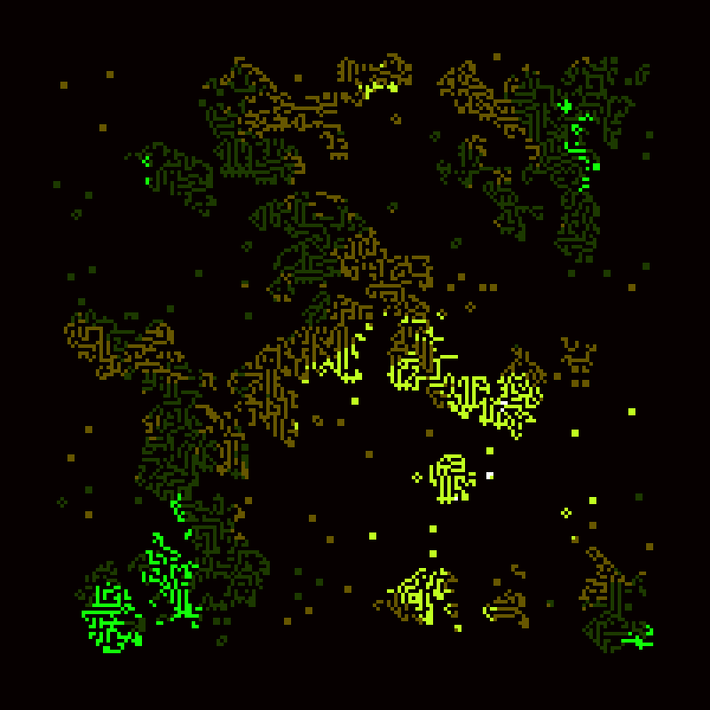
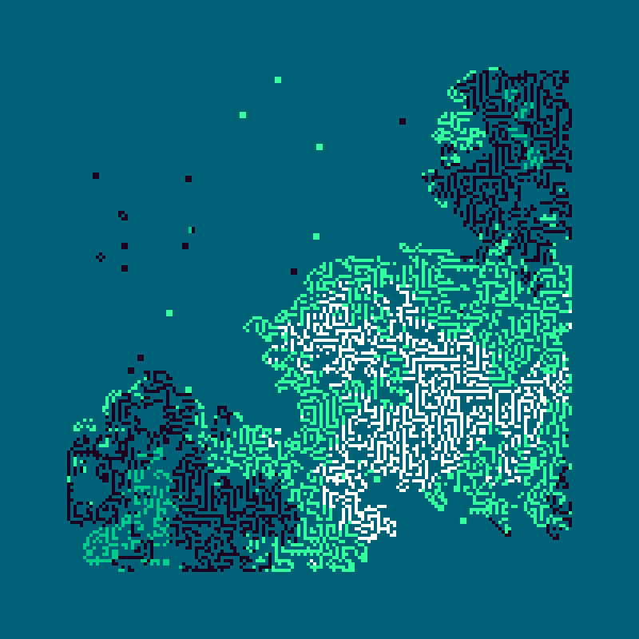
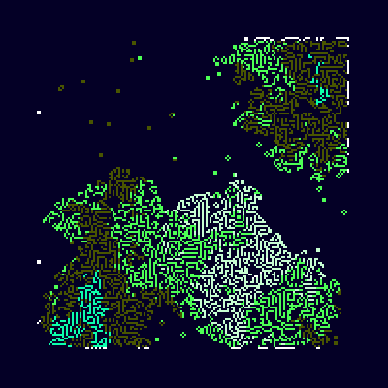
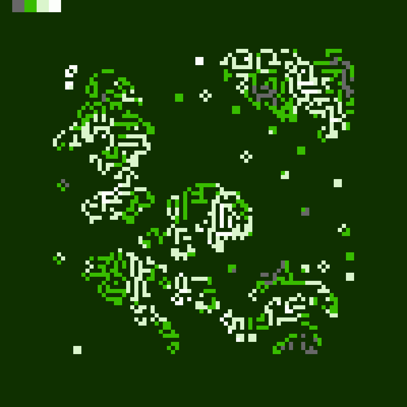
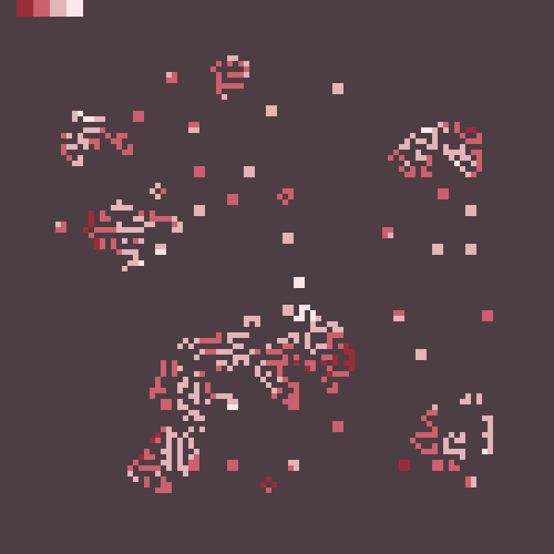

# Conway's Game of Life 

This is just a small adaptation of Conway's Game of Life, mixed with some Perlin Noise to add some color. 

This works by simply generating a cellular automata with the rules of the Game of Life, and then generating a color palette and applying it to the perlin noise map that lies behind the final figure.

Code is fully commented if in need of further information.

Here are some results, hope you like it!:

